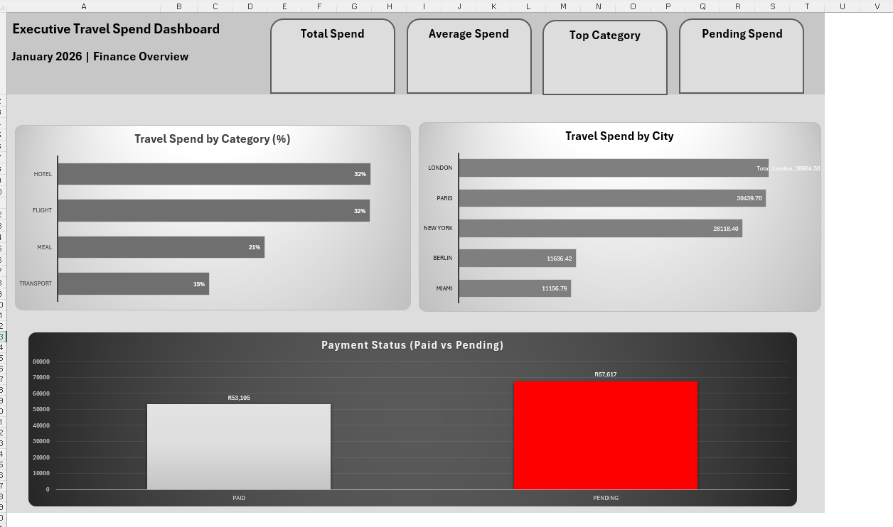

# 📊 Executive Travel Spend Dashboard (Excel)

## 📌 Project Overview

This project analyses executive travel expenses and presents insights through a structured and professional Excel dashboard.

The objective was to simulate a real-world finance reporting workflow — transforming raw, messy data into clean, actionable insights for executive decision-making.

---

## 🎯 Key Insights

* 💰 **Total Spend:** R120,722.59
* 📊 **Average Spend per Trip:** R804.82
* 🏆 **Top Expense Category:** Hotel (32%)
* ⚠️ **Pending Spend (Liability):** R67,617.18

---

## 📊 Dashboard Preview

---

## 🧩 Project Structure

The workbook follows a structured data pipeline approach:

* **Raw_Data** → Original dataset (unaltered)
* **Clean_Data** → Cleaned and standardized data
* **Pivot_Calc** → Pivot tables and calculations (analysis layer)
* **Dashboard** → Final executive-facing dashboard

---

## 🛠 Tools & Techniques

* Microsoft Excel
* Pivot Tables
* Data Cleaning (text standardisation, formatting)
* Dashboard Design & KPI reporting

---

## 💡 Business Value

This dashboard enables executives to:

* Monitor total travel expenditure
* Identify key cost drivers (Hotels, Flights, Meals, Transport)
* Track outstanding liabilities (pending payments)
* Support data-driven financial decisions

---

## 🚀 Future Improvements

* Build Power BI version of dashboard
* Add time-based trend analysis
* Automate data refresh process

---

## 👩‍💼 About Me

Aspiring Data Analyst with a strong focus on Excel-based reporting and dashboard development.
Currently building real-world projects to transition into data analytics.

---

